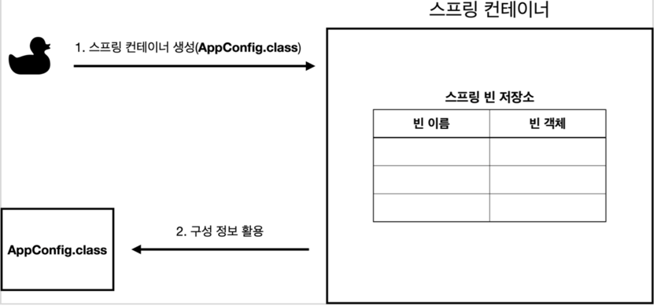
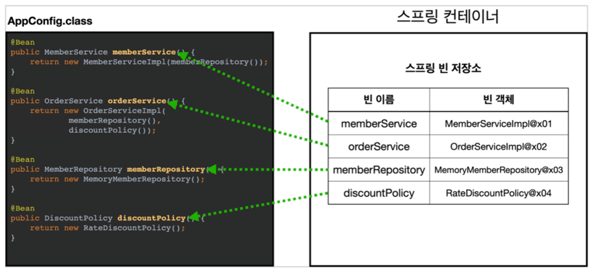
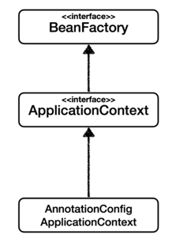
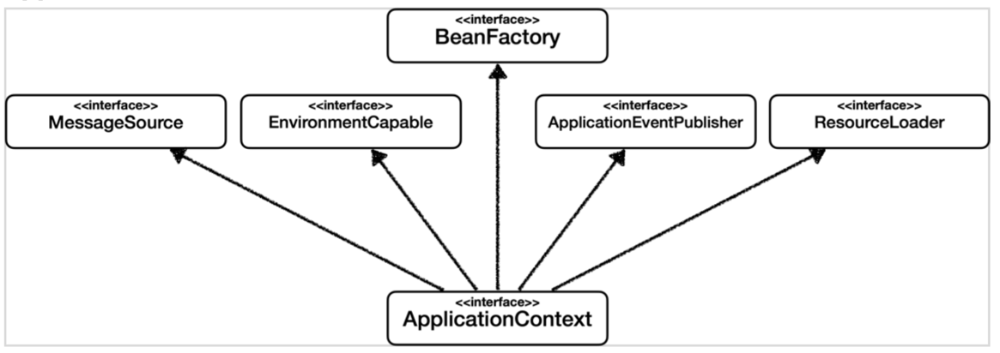

# Basic Spring
**Project** : Gradle Project

**Language** : Kotlin

**Spring Boot Version** : 2.5.3

**Project Metadata** Group : develop

**Artifact** : basicSpring

**packaging** : Jar

# IoC, DI, 컨테이너

**IoC(Inversion of Control)**
- 기존 프로그램은 클라이언트 구현 객체가 스스로 필요한 서버 구현 객체를 생성하고, 연결하고, 실행했다. 한마디로 구현객체가 프로그램의 제어 흐름을 스스로 조종했다.
- 해당 프로젝트에서 AppConfig를 개발한 이후에 구현 객체는 자신의 로직을 실행하는 역할만 담당한다. 즉, 프로그램의 제어 흐름은 이제 AppConfig가 가져간다.
- 예를 들어 OrderServiceImpl은 필요한 인터페이스들을 호출하지만 어떤 구현 객체들이 실행될지 모른다. 그리고 AppConfig는 OrderServiceImple이 아닌 OrderService 인터페이스의 다른 구현 객체를 생성하고 실행할 수 있다. 그런 사실도 모른체 OrderServiceImpl은 묵묵히 자신의 로직을 실행한다.
- 이렇듯 프로그램의 제어 흐름을 직접 제어하는 것이 아니라 외부에서 관리하는것을 제어의 역전이라 한다.

**DI(Dependency Injection)**
- OrderServiceImpl은 DiscountPolicy 인터페이스에 의존
- 애플리케이션 실행 시점(런타임)에 외부에서 실제 구현 객체를 생성하고 클라이언트에 전달해서 클라이언트와 서버의 실제 의존관계가 연결되는 것을 **의존관계 주입이**라 한다.
- 객체 인스턴스를 생성하고 그 참조값을 전달해서 연결된다.
- 의존관계 주입을 사용하면 클라이언트 코드를 변경하지 않고, 클라이언트가 호출하는 대상의 타입 인스턴스를 변경할 수 있다.

**IoC컨테이너, DI컨테이너**
- AppConfig 처럼 객체를 생성하고 관리하면서 의존관계를 연결해주는 것을 IoC 컨테이너 또는 DI 컨테이너라 한다.

# @Configuration, @Bean
- **@Configuration** : 설정 파일을 만들기 위한 어노테이션 (어노테이션 환경 구성을 돕는다.)
- **@Bean** : 스프링 컨테이너가 관리 할 수 있도록 객체를 Bean 등록하는 어노테이션
- 해당 예저에서 AppConfig에 @Configuration이 붙어있다. 여기서 @Bean이라 적힌 메서드를 모두 호출해서 반환된 객체를 스프링 컨테이너에 등록한다. 이렇게 스프링 컨테이너에 등록된 객체를 **스프링 빈**이라 한다.

# 스프링 컨테이너 생성
``` java
// 스프링 컨테이너 생성
ApplicationContext applicationContext = new AnnotationConfigApplicationContext(Appconfig.class);
```
- ApplicationContext를 스프링 컨테이너라 한다.
- new AnnotationConfigApplicationContext(Appconfig.class) 를 통해 구성 정보를 지정 (Appconfig.class가 구성 정보)



# BeanFactory와 ApplicationContext


**BeanFactory**
- 스프링 컨테이너의 최상위 인터페이스
- 스프링 빈을 관리하고 조회하는 역할을 담당, getBean()을 제공

**ApplicationContext**
- BeanFactory의 기능을 모두 상속받아서 제공

**이 둘의 차이??**
- 애플리케이션을 개발할 때는 빈은 관리하고 조회하는 기능은 물론이고, 수 많은 부가기능이 필요하다.

**ApplicationContext이 제공하는 부가기능**


# 싱글턴 패턴
**클래스의 인스턴스가 딱 1개만 생성되는 것을 보장하는 디자인 패턴**

기존에 만들었던 AppConfig는 요청을 할 때마다 객체를 새로 생성한다.
즉, 고객 트랙픽이 초당 100이 나온다면 초당 100개 객체가 생성되고 소멸된다. -> 메모리 낭비 심함
그렇기 때문에 해당 객체가 딱 1개만 생성되고, 공유하도록 설계한다. -> 싱글턴 패턴

- 싱글턴 패턴의 문제점?
    - 싱글턴 패턴을 구현하는 코드 자체가 많이 들어간다. 예) SingletonService
    - 의존관계상 클라이언트가 구체 클래스에 의존한다. -> DIP 위반
    - 클라이언트가 구체 클래스에 의존해서 OCP를 위반할 가능성이 높다.
    - private 생성자로 자식 클래스를 만들기 어렵다.
    - 결론적으로 유연성이 떨어진다.

### 싱글턴 컨테이너
스프링 컨테이너는 싱글턴 패턴의 문제점을 해결하면서 객체 인스턴스를 싱글턴으로 관리한다.
- 싱글턴 패턴을 적용하지 않아도 객체 인스턴스를 싱글턴으로 관리
- 스프링 컨테이너는 싱글턴 컨테이너 역할을 한다. 이렇게 싱글턴 객체를 관리하는 기능을 **싱글턴 레지스트리**라고 한다.

### 싱글턴 방식의 문제점
- 여러 클라이언트가 하나의 같은 객체 인스턴스를 공유하기 때문에 싱글톤 객체는 상태를 Stateful(유지)하게 설계하면 안된다.
- **Stateless(무상태)** 로 설계해야 한다.
    - 특정 클라이언트에 의존적인 필드가 있으면 안된다.
    - 가급적 읽기만 가능해야 한다.
    - 특정 클라이언트가 값을 변경할 수 있는 필드가 있으면 안된다.
    - 필드 대신에 자바에서 공유되지 않는 지역변수, 파라미터, ThreadLocal 등을 사용해야 한다.
- StatefulServiceTest 참고

### @Configuration 과 싱글턴
``` kotlin
    @Test
    fun configurationDeep() {
        val ac = AnnotationConfigApplicationContext(AppConfig::class.java)
        val bean = ac.getBean(AppConfig::class.java)

        log.info("bean = ${bean.javaClass}")
    }
```
- AnnotationConfigApplicationContext에 파라미터로 넘긴 값은 스프링 빈으로 등록된다. 그렇기 때문에 AppConfig도 스프링 빈이 된다.
- 순수한 클래스라면 `class hello.core.AppConfig`로 로그가 찍혀야 하지만 `class develop.basicSpring.AppConfig$$EnhancerBySpringCGLIB$$fee5a529` 이렇게 클래스 정보가 출력이 된다.
  
- 이것은 내가 만든 클래스가 아닌 스프링이 CGLIB라는 바이트코드 조작 라이브러리를 사용해 AppConfig 클래스를 상속받은 임의의 다른 클래스를 만들고, 그 다른 클래스를 스프링 빈으로 등록한 것이다.

### AppConfig@CGLIB 예상 코드
```kotlin
@Bean
fun memberRepository() {
    if (memberRepository가 이미 스프링 컨테이너에 등록되어 있다면?) {
        return 스프링 컨테이너에서 찾아서 반환
    } else {
        기존 로직을 호출해서 memberRepository를 생성하고 스프링 컨테이너에 등록
        return 반환        
    }
}
```
- @Bean이 붙은 메서드 마다 이미 스프링 빈이 존재하면 존재하는 빈을 반환하고, 스프링 빈이 없으면 생성해서 스프링 빈으로 등록하고 반환하는 코드가 동적으로 만들어다.

- 스프링 설정정보는 항상 **@Configuration** 을 사용하자

# 컴포넌트 스캔
스프링 설정 정보(AppConfig)가 없어도 자동으로 스프링 빈을 등록하는 컴포넌트 스캔 기능을 제공

### @ComponentScan
- @Component 어노테이션이 붙은 클래스를 스캔해서 스프링 빈으로 등록한다.
- 스프링 빈의 기본 이름은 클래스명을 사용하되 맨 앞글자만 소문자를 사용한다.

### @Component
- 개발자가 직접 작성한 Class를 Bean으로 등록하기 위한 어노테이션
- @Bean 어노테이션은 개발자가 컨트롤이 불가능한 외부 라이브러리들을 Bean으로 등록하고 싶을때 사용

### 탐색 위치와 기본 스캔 대상 
- 모든 자바 클래스를 다 컴포넌트 스캔하면 시간이 오래 걸리기 때문에 필요한 위치부터 탐색하도록 시작
```kotlin
@ComponentScan(
  basePackages = ["develop.basicSpring.member"]
)
```
- basePackages : 탐색할 패키지의 시작 위치를 지정한다. 만약 지정하지 않을 경우 **@ComponentScan**이 붙은 설정 정보 클래스의 패키지가 시작 위치가 된다.

### 컴포넌트 스캔 기본 대상
- @Component : 컴포넌트 스캔에서 사용
- @Controller : 스프링 MVC 컨트롤러에서 사용 
- @Service : 스프링 비즈니스 로직에서 사용
- @Repository : 스프링 데이터 접근 계층에서 사용
- @Configuration : 스프링 설정 정보에서 사용

### 컴포넌트 필터
```kotlin
@ComponentScan(
    includeFilters = [ComponentScan.Filter(type = FilterType.ANNOTATION, classes = arrayOf(MyIncludeComponent::class))],
    excludeFilters = [ComponentScan.Filter(type = FilterType.ANNOTATION, classes = arrayOf(MyExcludeComponent::class))]
)
```
- **includeFilters**에 MyIncludeComponent 어노테이션을 추가해서 BeanA가 스프링 빈에 등록
- **excludeFilters**에 MyExcludeComponent 어노테이션을 추가해서 BeanB는 스프링 빈에 등록되지 않는다.

# 의존관계 주입 방법
1. 생성자 주입
- 생성자를 통해서 의존관계를 주입받는 방법
- **불변**, **필수** 의존관계에 사용
- **생성자가 딱 1개만 있으면 @Autowired를 생략해도 자동 주입 가능**

2. Setter 주입
- setter라 불리는 필드의 값을 변경하는 수정자 메서드를 통해서 의존관계를 주입
- **선택**, **변경** 가능성이 있는 의존관계에 사용
