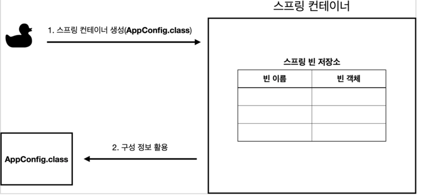
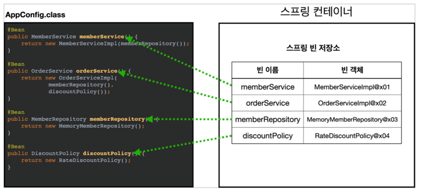
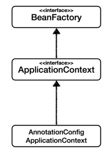
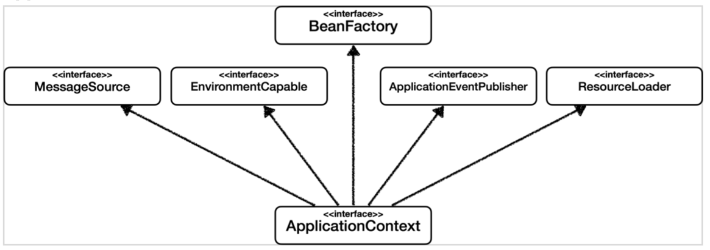

# Basic Spring
**Project** : Gradle Project

**Language** : Kotlin

**Spring Boot Version** : 2.5.3

**Project Metadata** Group : develop

**Artifact** : basicSpring

**packaging** : Jar

# IoC, DI, 컨테이너

**IoC(Inversion of Control)**
- 기존 프로그램은 클라이언트 구현 객체가 스스로 필요한 서버 구현 객체를 생성하고, 연결하고, 실행했다. 한마디로 구현객체가 프로그램의 제어 흐름을 스스로 조종했다.
- 해당 프로젝트에서 AppConfig를 개발한 이후에 구현 객체는 자신의 로직을 실행하는 역할만 담당한다. 즉, 프로그램의 제어 흐름은 이제 AppConfig가 가져간다.
- 예를 들어 OrderServiceImpl은 필요한 인터페이스들을 호출하지만 어떤 구현 객체들이 실행될지 모른다. 그리고 AppConfig는 OrderServiceImple이 아닌 OrderService 인터페이스의 다른 구현 객체를 생성하고 실행할 수 있다. 그런 사실도 모른체 OrderServiceImpl은 묵묵히 자신의 로직을 실행한다.
- 이렇듯 프로그램의 제어 흐름을 직접 제어하는 것이 아니라 외부에서 관리하는것을 제어의 역전이라 한다.

**DI(Dependency Injection)**
- OrderServiceImpl은 DiscountPolicy 인터페이스에 의존
- 애플리케이션 실행 시점(런타임)에 외부에서 실제 구현 객체를 생성하고 클라이언트에 전달해서 클라이언트와 서버의 실제 의존관계가 연결되는 것을 **의존관계 주입이**라 한다.
- 객체 인스턴스를 생성하고 그 참조값을 전달해서 연결된다.
- 의존관계 주입을 사용하면 클라이언트 코드를 변경하지 않고, 클라이언트가 호출하는 대상의 타입 인스턴스를 변경할 수 있다.

**IoC컨테이너, DI컨테이너**
- AppConfig 처럼 객체를 생성하고 관리하면서 의존관계를 연결해주는 것을 IoC 컨테이너 또는 DI 컨테이너라 한다.

# @Configuration, @Bean
- **@Configuration** : 설정 파일을 만들기 위한 어노테이션 (어노테이션 환경 구성을 돕는다.)
- **@Bean** : 스프링 컨테이너가 관리 할 수 있도록 객체를 Bean 등록하는 어노테이션
- 해당 예저에서 AppConfig에 @Configuration이 붙어있다. 여기서 @Bean이라 적힌 메서드를 모두 호출해서 반환된 객체를 스프링 컨테이너에 등록한다. 이렇게 스프링 컨테이너에 등록된 객체를 **스프링 빈**이라 한다.

# 스프링 컨테이너 생성
``` java
// 스프링 컨테이너 생성
ApplicationContext applicationContext = new AnnotationConfigApplicationContext(Appconfig.class);
```
- ApplicationContext를 스프링 컨테이너라 한다.
- new AnnotationConfigApplicationContext(Appconfig.class) 를 통해 구성 정보를 지정 (Appconfig.class가 구성 정보)



# BeanFactory와 ApplicationContext


**BeanFactory**
- 스프링 컨테이너의 최상위 인터페이스
- 스프링 빈을 관리하고 조회하는 역할을 담당, getBean()을 제공

**ApplicationContext**
- BeanFactory의 기능을 모두 상속받아서 제공

**이 둘의 차이??**
- 애플리케이션을 개발할 때는 빈은 관리하고 조회하는 기능은 물론이고, 수 많은 부가기능이 필요하다.

**ApplicationContext이 제공하는 부가기능**

